  

<!-- ──────────────────────────────── CONNECT ──────────────────────────────── -->

  <h2>Let's Connect</h2>

  | LinkedIn | GitHub | Website |
  | :---: | :---: | :---: |
  |  |  |  |

   
  

<!-- ──────────────────────────────── METRICS ──────────────────────────────── -->

<h2 align="center">Stats</h2>

  

<!-- ──────────────────────────────── TECH STACK ──────────────────────────────── -->

<h2 align="center">Tech Stack</h2>

<h4 align="center">Languages</h4>

  
  
  
  
  
  

<h4 align="center">Frontend</h4>

  
  
  
  
  
  

<h4 align="center">Backend</h4>

  
  
  
  
  
  
  

<h4 align="center">DevOps & Cloud</h4>

  
  
  
  
  
  
  

<h4 align="center">Databases</h4>

  
  
  
  
  

<!-- ──────────────────────────────── CERTIFICATIONS ──────────────────────────────── -->

<h2 align="center">Certifications</h2>

  <table style="width:100%; table-layout:fixed;">
    <colgroup>
      <col style="width:20%">
      <col style="width:20%">
      <col style="width:20%">
      <col style="width:20%">
      <col style="width:20%">
    </colgroup>
    <tr>
      <!-- Icon Row -->
      <td align="center">
        
      </td>
      <td align="center">
        
      </td>
      <td align="center">
        
      </td>
      <td align="center">
        
      </td>
      <td align="center">
        
      </td>
    </tr>
    <tr>
      <!-- Text Row -->
      <td align="center" valign="top">
        Jul 2025 
        <em>Python, pandas, NumPy for data analysis workflows.</em>
      </td>
      <td align="center" valign="top">
        Jan 2026 
        <em>Optimization modelling with Python & scikit-learn.</em>
      </td>
      <td align="center" valign="top">
        Mar 2026 
        <em>LLMs, prompt design, and applied GenAI engineering.</em>
      </td>
      <td align="center" valign="top">
        Jul 2025 
        <em>Statistical analysis & data visualization with Python.</em>
      </td>
      <td align="center" valign="top">
        Coming Soon 
        <em>Next credential dropping soon — stay tuned!</em>
      </td>
    </tr>
  </table>

<!-- ──────────────────────────────── FOOTER ──────────────────────────────── -->

