<p align="center">
  <a href="https://git.io/typing-svg">
    
  </a>
</p>

<p align="center">
  <a href="https://linkedin.com/in/haarissadiq"></a>&nbsp;
  <a href="mailto:haaris.sadiq.786@gmail.com"></a>&nbsp;
  <a href="https://github.com/Haaris-7"></a>&nbsp;
  
</p>

<!-- ──────────────────────────────────────────────────────────── -->

<table align="center" border="0" cellpadding="0" cellspacing="0">
<tr>
<td width="50%" valign="top">

### `> whoami`

```yaml
name: Haaris Sadiq
location: Dubai, UAE <-> Waterloo, ON
education:
  degree: BASc Mechatronics Engineering (Co-op)
  school: University of Waterloo
  start: 2025
role: Software Development Intern @ PwC (AI CoE)
team: Core Member @ WATonomous
interests:
  - Autonomous Systems
  - Full-Stack AI Platforms
  - Computer Vision & Robotics
  - Embedded Systems
```

</td>
<td width="50%" valign="top">

### `> recent_work`

**AI Assets Storefront** `@PwC`
> Firm-wide AI platform serving **7,500+** consultants — React/Next.js, OpenAI Agents SDK, Azure. Under evaluation for **global rollout**.

**Real-Time Object Recognition**
> **40 FPS** on Raspberry Pi 5 with YOLOv11 + custom OpenCV across **365** object categories.

**Autonomous Navigation** `@WATonomous`
> C++/ROS2 point-to-point navigation with obstacle avoidance — **~100%** success rate in Gazebo sim.

**PillBot**
> Autonomous medication delivery rover with colour-based line following & calibrated dispensing.

</td>
</tr>
</table>

<!-- ──────────────────────────────────────────────────────────── -->

<h2 align="center">Tech Stack</h2>

<p align="center">
  <picture>
    <source media="(prefers-color-scheme: dark)" srcset="https://skillicons.dev/icons?i=python,cpp,ts,js,react,nextjs,fastapi,opencv&theme=dark&perline=8" />
    <source media="(prefers-color-scheme: light)" srcset="https://skillicons.dev/icons?i=python,cpp,ts,js,react,nextjs,fastapi,opencv&theme=light&perline=8" />
    
  </picture>
</p>
<p align="center">
  <picture>
    <source media="(prefers-color-scheme: dark)" srcset="https://skillicons.dev/icons?i=docker,linux,azure,git,ros,tailwind,github,vscode&theme=dark&perline=8" />
    <source media="(prefers-color-scheme: light)" srcset="https://skillicons.dev/icons?i=docker,linux,azure,git,ros,tailwind,github,vscode&theme=light&perline=8" />
    
  </picture>
</p>

<details>
<summary align="center"><b>Full breakdown</b></summary>
<br/>

| Category | Technologies |
|:---------|:-------------|
| **Languages** | Python, C++, TypeScript, JavaScript, SQL |
| **Frontend** | React, Next.js, Tailwind CSS |
| **Backend & AI** | FastAPI, OpenAI Agents SDK, LangChain, Langfuse |
| **Computer Vision** | OpenCV, YOLOv11 |
| **Data & ML** | pandas, NumPy, scikit-learn |
| **Robotics** | ROS2, Gazebo, VEX IQ |
| **Databases** | CosmosDB, Qdrant |
| **DevOps & Cloud** | Docker, Azure, Azure Pipelines, Git, Linux |
| **Auth & Security** | OAuth 2.0, JWT, RBAC |

</details>

<!-- ──────────────────────────────────────────────────────────── -->

<h2 align="center">Metrics</h2>

<p align="center">
  <picture>
    <source media="(prefers-color-scheme: dark)" srcset="github-metrics.svg" />
    <source media="(prefers-color-scheme: light)" srcset="github-metrics.svg" />
    
  </picture>
</p>

<p align="center">
  <picture>
    <source media="(prefers-color-scheme: dark)" srcset="metrics.plugin.isocalendar.fullyear.svg" />
    <source media="(prefers-color-scheme: light)" srcset="metrics.plugin.isocalendar.fullyear.svg" />
    
  </picture>
</p>

<p align="center">
  
  
</p>

<!-- ──────────────────────────────────────────────────────────── -->

<h2 align="center">Stats</h2>

<p align="center">
  <picture>
    <source media="(prefers-color-scheme: dark)" srcset="https://github-readme-stats.vercel.app/api?username=Haaris-7&show_icons=true&theme=github_dark&hide_border=true&bg_color=0d1117&title_color=58a6ff&icon_color=58a6ff&text_color=c9d1d9&ring_color=58a6ff&rank_icon=github" />
    <source media="(prefers-color-scheme: light)" srcset="https://github-readme-stats.vercel.app/api?username=Haaris-7&show_icons=true&theme=default&hide_border=true&rank_icon=github" />
    
  </picture>
  <picture>
    <source media="(prefers-color-scheme: dark)" srcset="https://streak-stats.demolab.com/?user=Haaris-7&theme=github-dark-blue&hide_border=true&background=0d1117&ring=58a6ff&fire=58a6ff&currStreakLabel=58a6ff" />
    <source media="(prefers-color-scheme: light)" srcset="https://streak-stats.demolab.com/?user=Haaris-7&theme=default&hide_border=true" />
    
  </picture>
</p>

<!-- ──────────────────────────────────────────────────────────── -->

<h2 align="center">Activity</h2>

<p align="center">
  <picture>
    <source media="(prefers-color-scheme: dark)" srcset="https://github-readme-activity-graph.vercel.app/graph?username=Haaris-7&theme=github-dark&hide_border=true&bg_color=0d1117&color=c9d1d9&line=58a6ff&point=58a6ff&area=true&area_color=1a1b27" />
    <source media="(prefers-color-scheme: light)" srcset="https://github-readme-activity-graph.vercel.app/graph?username=Haaris-7&theme=github-light&hide_border=true&area=true" />
    
  </picture>
</p>

<p align="center">
  <picture>
    <source media="(prefers-color-scheme: dark)" srcset="https://raw.githubusercontent.com/Haaris-7/Haaris-7/output/github-snake-dark.svg" />
    <source media="(prefers-color-scheme: light)" srcset="https://raw.githubusercontent.com/Haaris-7/Haaris-7/output/github-snake.svg" />
    
  </picture>
</p>

<!-- ──────────────────────────────────────────────────────────── -->


