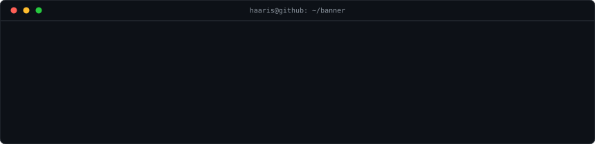
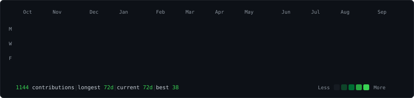
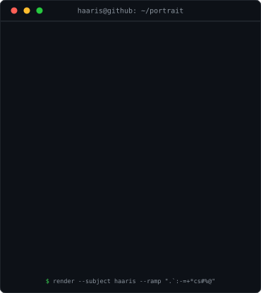
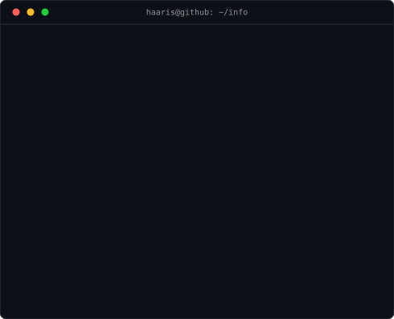

  

<h3><code>haaris@github ~ $ ./contributions.sh</code></h3>

  

<h3><code>haaris@github ~ $ whoami</code></h3>

<table>
  <tr>
    <td valign="top"></td>
    <td valign="top"></td>
  </tr>
</table>

 

<h3><code>haaris@github ~ $ cat links.txt</code></h3>

<a href="https://haarissadiq.dev"><code>haarissadiq.dev (work in progress)</code></a>
&nbsp;·&nbsp;
<a href="https://www.linkedin.com/in/haaris-sadiq/"><code>linkedin/haaris-sadiq</code></a>
&nbsp;·&nbsp;
<a href="https://x.com/s_haaris25714"><code>x/@s_haaris25714</code></a>
&nbsp;·&nbsp;
<a href="https://github.com/Haaris-7"><code>github/Haaris-7</code></a>

  

SVGs generated by Python scripts in <a href="./scripts"><code>scripts/</code></a> — refreshed daily by GitHub Actions. No third-party badge services.

